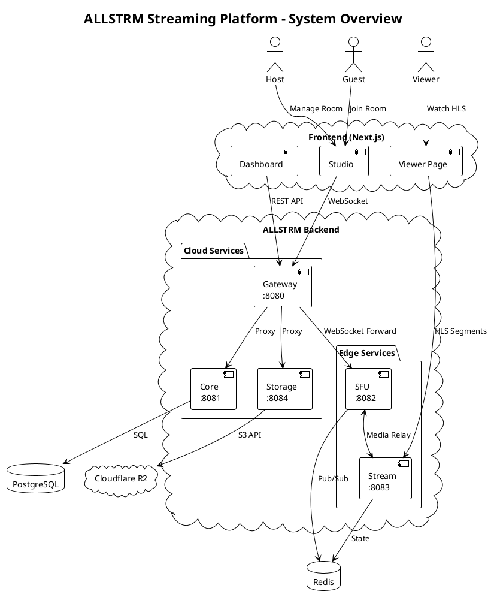
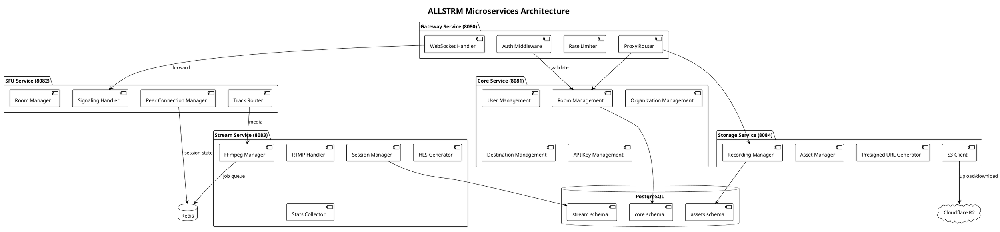
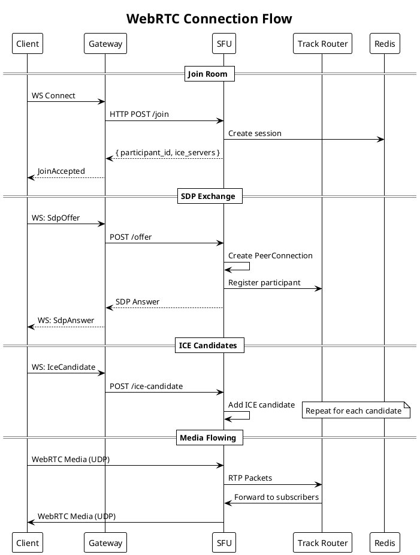
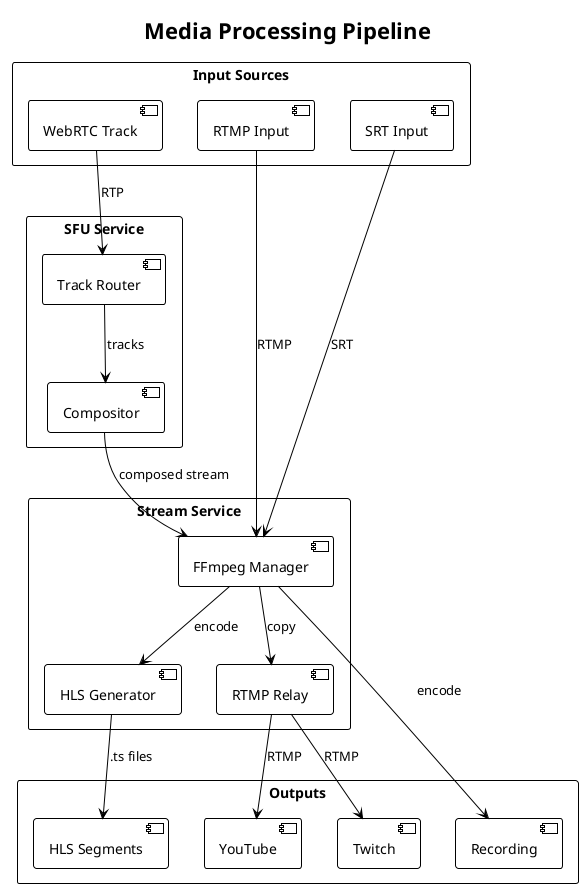
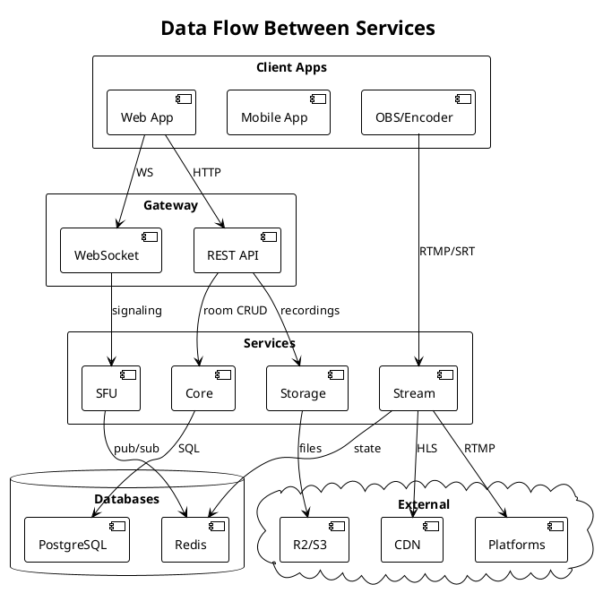
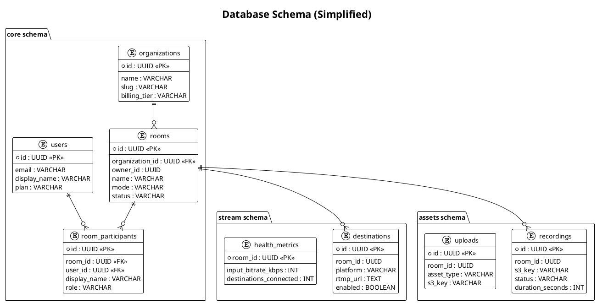
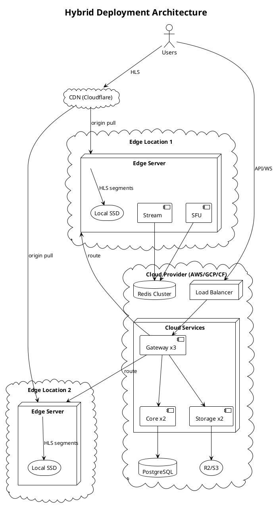

# ALLSTRM Architecture Diagrams

This document contains architecture diagrams in PlantUML format. You can render these using:
- [PlantUML Online](https://www.plantuml.com/plantuml/uml)
- VS Code PlantUML extension
- IntelliJ IDEA PlantUML plugin

## 1. System Overview



## 2. Service Architecture



## 3. WebRTC Signaling Flow



## 4. Streaming Pipeline



## 5. Data Flow



## 6. Database Schema



## 7. Deployment Architecture



## Rendering Instructions

### Using PlantUML Online

1. Go to https://www.plantuml.com/plantuml/uml
2. Copy the PlantUML code block (including `@startuml` and `@enduml`)
3. Paste and view the rendered diagram

### Using VS Code

1. Install "PlantUML" extension
2. Open this file
3. Press `Alt+D` to preview diagrams

### Export as PNG/SVG

```bash
# Using PlantUML CLI
java -jar plantuml.jar docs/architecture/DIAGRAMS.md -o output/

# Using Docker
docker run -v $(pwd):/data plantuml/plantuml DIAGRAMS.md
```
