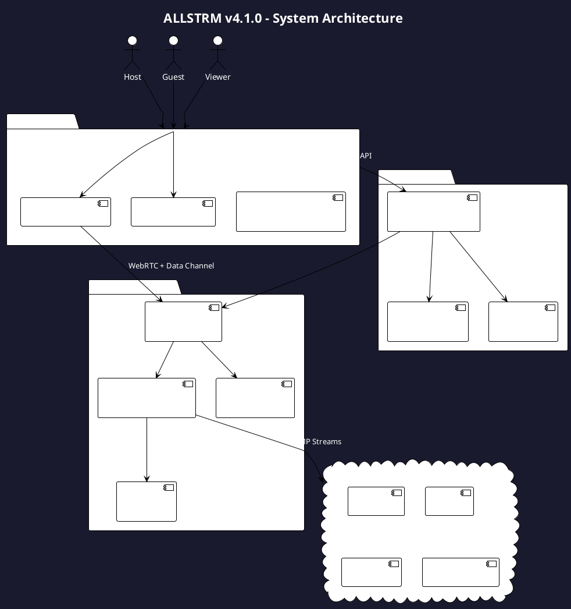
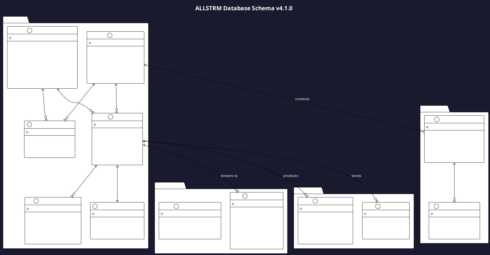
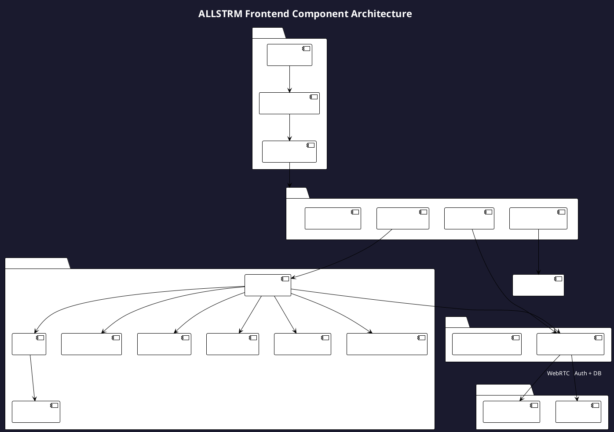
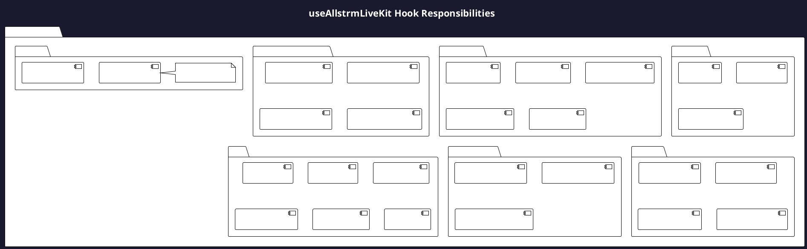
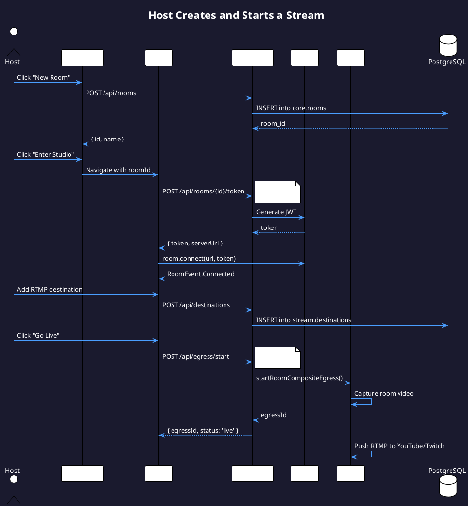
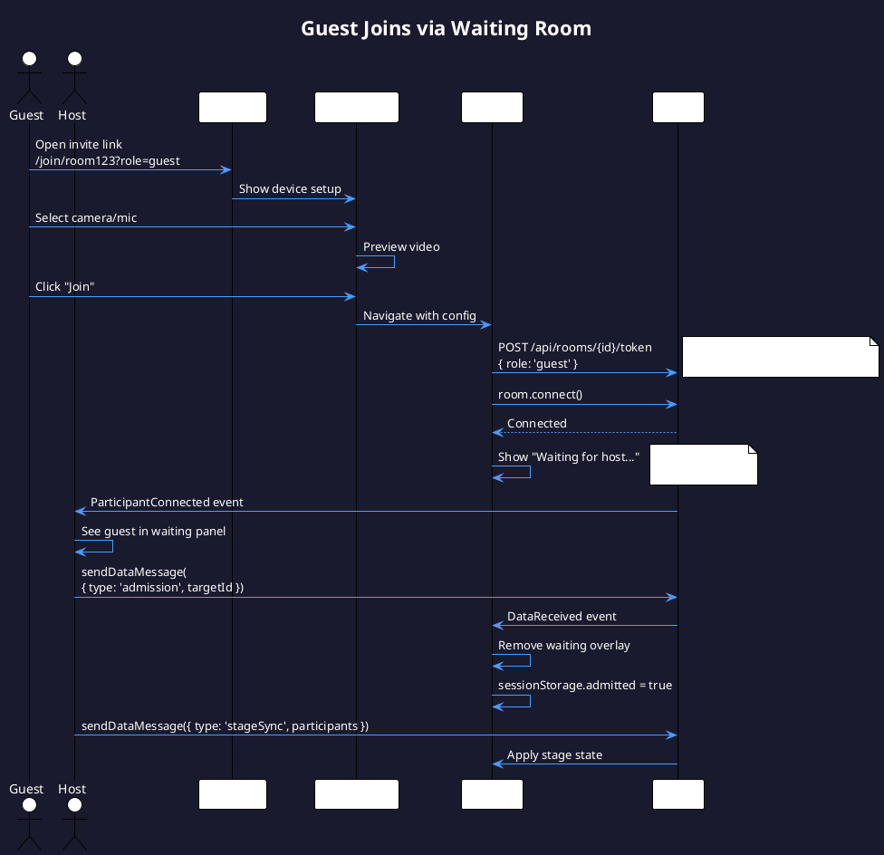
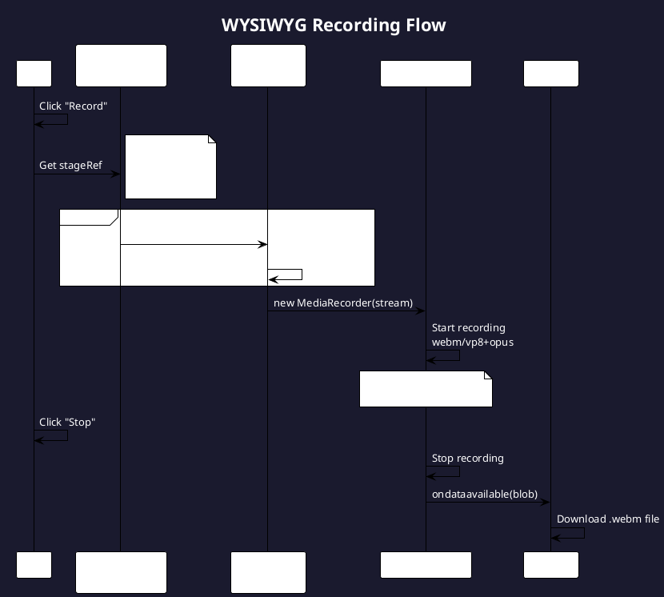
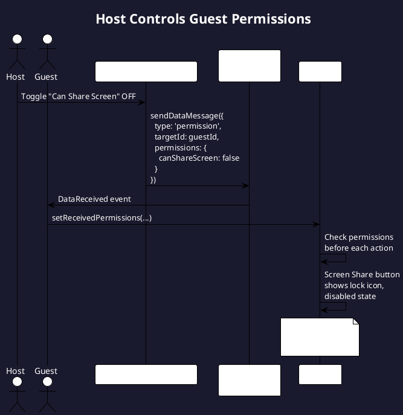
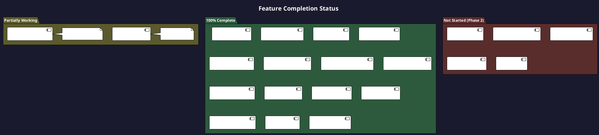

# ALLSTRM v4.1.0 - Complete Architecture Documentation

## Table of Contents
1. [System Overview](#1-system-overview)
2. [What Was Built](#2-what-was-built)
3. [Database Schema](#3-database-schema)
4. [Component Architecture](#4-component-architecture)
5. [Key User Flows](#5-key-user-flows)
6. [Why These Decisions](#6-why-these-decisions)
7. [Feature Completion](#7-feature-completion)

---

## 1. System Overview

### High-Level Architecture



### What This Diagram Shows
- **Three user roles**: Host (full control), Guest (limited permissions), Viewer (watch only)
- **Client layer**: Next.js frontend with LiveKit SDK for real-time media
- **Backend layer**: API routes with rate limiting, Supabase for auth and database
- **Media layer**: LiveKit handles all WebRTC complexity, Egress handles streaming out

---

## 2. What Was Built

### Technology Stack

| Layer | Technology | Purpose |
|-------|------------|---------|
| **Frontend** | Next.js 16 + React 19 | UI rendering, SSR |
| **State** | React Hooks + Context | No Redux needed |
| **Styling** | Tailwind CSS 4 | Utility-first CSS |
| **WebRTC** | LiveKit Client SDK | Real-time media |
| **Auth** | Supabase Auth | JWT + OAuth providers |
| **Database** | PostgreSQL 15+ | Via Supabase |
| **SFU** | LiveKit Server | WebRTC routing |
| **Egress** | LiveKit Egress | RTMP + Recording |
| **Storage** | MinIO (dev) / R2 (prod) | S3-compatible |
| **Cache** | Redis 7 | LiveKit state |

### Directory Structure

```
allstrm-backend/
├── frontend-next/
│   └── src/
│       ├── app/                    # Next.js App Router
│       │   ├── api/               # API Routes (rate-limited)
│       │   │   ├── rooms/         # Room CRUD + token generation
│       │   │   ├── egress/        # Start/stop streaming
│       │   │   ├── destinations/  # RTMP destinations
│       │   │   ├── oauth/         # Platform OAuth flows
│       │   │   └── users/         # User tier info
│       │   ├── studio/[roomId]/   # Host interface
│       │   ├── meeting/[roomId]/  # Guest interface
│       │   ├── dashboard/         # Room management
│       │   └── login/, signup/    # Auth pages
│       ├── components/
│       │   ├── Studio.tsx         # Main host component (~1000 lines)
│       │   ├── Meeting.tsx        # Guest view
│       │   ├── ErrorBoundary.tsx  # Error handling
│       │   ├── GreenRoom/         # Pre-call device setup
│       │   └── studio/            # Sub-components
│       ├── hooks/
│       │   └── useAllstrmLiveKit.ts  # Core LiveKit integration (~1660 lines)
│       ├── contexts/
│       │   └── AuthContext.tsx    # Auth + tier + multi-tab
│       ├── lib/
│       │   ├── api.ts             # API client
│       │   ├── rateLimit.ts       # Rate limiting utility
│       │   └── constants.ts       # Config
│       ├── types/
│       │   └── index.ts           # TypeScript interfaces
│       └── utils/
│           ├── permissions.ts     # Tier-based feature gating
│           └── layoutEngine.ts    # Video layout calculations
├── migrations/
│   └── 003_consolidated_all.sql   # Complete DB schema (v4.1.0)
├── docs/
│   ├── ARCHITECTURE.md            # High-level design
│   └── architecture/
│       └── DIAGRAMS.md            # This file
└── docker-compose.yml             # Local dev stack
```

---

## 3. Database Schema

### Entity Relationship Diagram



### Schema Design Rationale

| Schema | Purpose | Why Separate? |
|--------|---------|---------------|
| **core** | Users, orgs, rooms | Core business logic, frequently queried |
| **stream** | RTMP, health metrics | Hot data with frequent updates |
| **assets** | Recordings, uploads | Large file metadata, separate scaling |
| **public** | OAuth connections | Supabase Auth integration, RLS policies |

### Key Constraints Added in v4.1.0
- ✅ FK constraints on `stream.destinations` → `core.rooms`, `core.users`
- ✅ `broadcast` tier added to plan CHECK constraints
- ✅ Removed duplicate `is_enabled` column
- ✅ Consolidated oauth_connections to public schema

---

## 4. Component Architecture

### Frontend Component Hierarchy



### useAllstrmLiveKit Hook - The Core

This is the heart of the application (~1660 lines). It handles:



---

## 5. Key User Flows

### Flow 1: Host Creates and Starts a Stream



### Flow 2: Guest Joins via Waiting Room



### Flow 3: WYSIWYG Recording



### Flow 4: Permission Control



---

## 6. Why These Decisions

### Why LiveKit instead of Custom SFU?

| Aspect | Custom SFU (Old v1) | LiveKit (v4) |
|--------|---------------------|--------------|
| **Code to maintain** | ~15,000 lines Rust | 0 lines |
| **Features** | Basic SFU | Simulcast, Dynacast, Recording |
| **Time to production** | 6+ months | 2 weeks |
| **Scaling** | Custom k8s setup | LiveKit Cloud |
| **Cost** | High DevOps burden | $0.004/participant-minute |

**Decision**: Outsource undifferentiated heavy lifting. Focus on product features.

### Why Supabase instead of Custom Auth?

| Aspect | Custom Auth | Supabase |
|--------|-------------|----------|
| **JWT handling** | Manual | Built-in |
| **OAuth providers** | Implement each | Toggle on |
| **Row-level security** | Build from scratch | SQL policies |
| **Realtime** | WebSocket server | Built-in |

**Decision**: Auth is a solved problem. Don't reinvent.

### Why Schema Partitioning?

```
core schema   → Users, Rooms (frequently read, rarely updated)
stream schema → Health metrics (hot table, updates every second)
assets schema → Recordings (large files, separate backup strategy)
```

**Decision**: Prevent hot tables (health_metrics) from blocking core operations. Allows independent scaling.

### Why Client-Side Recording?

| Approach | Pros | Cons |
|----------|------|------|
| **Server-side (Egress)** | Higher quality, ISO tracks | Costs $$$, delayed access |
| **Client-side (Canvas)** | Instant, free, WYSIWYG | Browser-dependent |

**Decision**: Start with client-side for immediate value. Add server-side for Pro+ tiers.

### Why In-Memory Rate Limiting?

```typescript
// Simple, effective, no external dependencies
const rateLimitStore = new Map<string, RateLimitEntry>();
```

**Decision**: Good enough for single-instance. Can swap to Redis for multi-instance later.

---

## 7. Feature Completion

### What Works Now (v4.1.0)



### API Endpoints Status

| Endpoint | Method | Rate Limit | Status |
|----------|--------|------------|--------|
| `/api/rooms` | GET/POST/PATCH/DELETE | 20/min | ✅ Working |
| `/api/rooms/[id]/token` | POST | 30/min | ✅ Working |
| `/api/egress/start` | POST | 10/min | ✅ Working |
| `/api/egress/stop` | POST | 10/min | ✅ Working |
| `/api/destinations` | GET/POST/PATCH/DELETE | 30/min | ✅ Working |
| `/api/oauth/[provider]/authorize` | POST | 20/min | ✅ Working |
| `/api/oauth/[provider]/callback` | GET | 20/min | ✅ Working |
| `/api/users/[id]/tier` | GET | 100/min | ✅ Working |

### Database Health

- ✅ All FK constraints in place
- ✅ Indexes on frequently queried columns
- ✅ RLS policies on all user-facing tables
- ✅ Triggers for `updated_at` auto-update
- ✅ Cleanup functions for stale data

---

## Rendering These Diagrams

### Option 1: PlantUML Server
```bash
# Using PlantUML public server
curl -X POST -d "@diagram.puml" http://www.plantuml.com/plantuml/png/
```

### Option 2: Local PlantUML
```bash
# Install PlantUML
brew install plantuml  # macOS
sudo apt install plantuml  # Ubuntu

# Generate PNG
plantuml DIAGRAMS.md
```

### Option 3: VS Code Extension
Install "PlantUML" extension by jebbs, then use `Alt+D` to preview.

### Option 4: Online Editors
- [PlantUML Web Server](http://www.plantuml.com/plantuml/uml/)
- [PlantText](https://www.planttext.com/)

---

*Last Updated: January 26, 2026 - Version 4.1.0*
